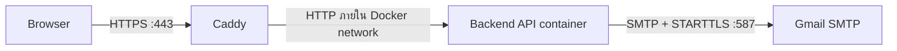

# คู่มือตั้งค่า SMTP สำหรับอีเมล OTP

เอกสารส่งต่อทีม backend สำหรับเปิดใช้งานอีเมล OTP กู้รหัสผ่านและ PIN โดยยึด flow ที่ frontend ใช้และการส่งเมลที่ทดสอบผ่าน `mock_backend.py` แล้ว

> ไฟล์นี้ไม่มี username, App Password หรือ secret จริง เจ้าของระบบจะส่งค่า `.env` ให้ backend แยกช่องทาง

## สรุปเรื่อง Caddy

Caddy ดูแล HTTPS ที่ผู้ใช้เรียกเว็บและ reverse proxy คำขอ HTTP ไป backend ส่วนการส่งอีเมลเป็นการเชื่อมต่อขาออกจาก backend container ไปยัง SMTP provider โดยตรง ไม่ต้องเพิ่ม SMTP ใน Caddyfile และไม่ต้องเปิด port 587 รับจากอินเทอร์เน็ต



ถ้า browser แจ้งว่าเว็บ “ไม่ปลอดภัย” หรือ certificate error ให้ตรวจ HTTPS/DNS/Caddy แยกจาก SMTP ถ้า API ส่ง `503` และ backend log มี `SMTPAuthenticationError`, `SMTPConnectError` หรือ timeout ค่อยไล่ค่าบัญชี SMTP และ outbound network

## 1. เตรียมบัญชีผู้ส่ง Gmail

1. เลือก Gmail กลางของระบบ เช่น mailbox ที่ทีมดูแลร่วมกัน
2. เปิด **2-Step Verification** ใน Google Account
3. สร้าง **App Password** สำหรับระบบนี้ และใช้ค่านั้นแทนรหัสผ่าน Gmail ปกติ
4. คัดลอก App Password โดยตัดช่องว่างออกก่อนนำไปใส่ secret
5. ใช้อีเมลบัญชีเดียวกันเป็น `EMAIL_HOST_USER` และ `DEFAULT_FROM_EMAIL` เว้นแต่บัญชีผู้ส่งได้ตั้ง alias ที่ Google อนุญาตไว้แล้ว

บัญชี Google Workspace อาจถูกนโยบายผู้ดูแลระบบจำกัดการสร้าง App Password ถ้าไม่มีเมนูนี้ ให้ผู้ดูแล Workspace เปิดทางที่องค์กรอนุมัติ หรือเลือก SMTP provider ที่ backend ใช้ได้

## 2. ใส่ค่าใน environment ของ backend container

ให้ backend ตั้งค่าที่ VM/secret store/Docker runtime ของ **backend** ไม่ใช่ frontend `.env` และไม่ใส่ secret ใน Dockerfile, Docker build arguments หรือ Git

ค่าต่อไปนี้ใช้ Gmail SMTP แบบที่ mock ทดสอบแล้ว:

```dotenv
EMAIL_HOST=smtp.gmail.com
EMAIL_PORT=587
EMAIL_HOST_USER=<บัญชี Gmail ผู้ส่ง>
EMAIL_HOST_PASSWORD=<App Password ที่ส่งให้ backend แยก>
EMAIL_USE_TLS=true
EMAIL_USE_SSL=false
EMAIL_TIMEOUT=15
DEFAULT_FROM_EMAIL="OPD Queue <บัญชี Gmail ผู้ส่ง>"
```

สำหรับ Docker Compose ให้ส่งค่าเข้า service ที่รัน API ผ่าน environment หรือไฟล์ secret ที่อยู่นอก Git เช่น `env_file` บน VM จากนั้น recreate เฉพาะ backend container เมื่อเปลี่ยนค่า ห้ามส่งค่าลับมาไว้ใน image ตอน build

```bash
docker compose up -d --force-recreate <backend-service>
```

### ถ้า backend ใช้ Django

ให้ map environment เหล่านี้เข้ากับ SMTP email backend และแปลง boolean จาก string อย่างชัดเจน (`"true"` เป็น `True`) ตั้ง port `587` คู่กับ STARTTLS (`EMAIL_USE_TLS=True`) และ `EMAIL_USE_SSL=False` อย่าเปิด TLS สองแบบพร้อมกัน

ถ้าใช้ Django รุ่นที่มี `MAILERS` ให้ใช้รูปแบบ config ตาม Django version ที่ pin ไว้ใน backend repo; รุ่นที่ยังใช้ `EMAIL_*` settings ให้ map ตามชื่อตัวแปรในตัวอย่าง หากไม่ใช่ Django ให้ map ค่าเดียวกันเข้ากับ mail library ของ framework ที่ใช้อยู่

## 3. ตั้ง SMTP/TLS ให้ตรงกัน

ใช้ชุดใดชุดหนึ่งเท่านั้น:

| SMTP mode | Host/port | การตั้งค่า |
|---|---|---|
| แนะนำสำหรับ Gmail | `smtp.gmail.com:587` | SMTP แล้ว `STARTTLS`, เปิด `EMAIL_USE_TLS`, ปิด `EMAIL_USE_SSL` |
| ทางเลือก | `smtp.gmail.com:465` | TLS ตั้งแต่เริ่มเชื่อมต่อ, เปิด `EMAIL_USE_SSL`, ปิด `EMAIL_USE_TLS` |

อย่าใช้ port `587` แล้วเรียก implicit SSL ตั้งแต่เริ่ม และอย่าใช้ port `465` แล้วเรียก `STARTTLS` ซ้ำ ค่า SMTP ควรเป็น ASCII; ชื่อแสดงผู้ส่งภาษาไทยทำได้เมื่อ mail library encode header เป็น UTF-8 ตามมาตรฐาน

โค้ดอ้างอิงใน repo นี้อยู่ที่ `mock_backend.py` ฟังก์ชัน `send_email()` รองรับ port `587` แบบ STARTTLS และ `465` แบบ SMTP SSL ส่วน `send_otp_email()` สร้างเนื้อหา OTP ภาษาไทยแบบ UTF-8 ตัวแปร `MOCK_SMTP_*` ใช้กับ mock เท่านั้น; backend production ให้ใช้ค่า `EMAIL_*` หรือชื่อที่ framework กำหนด

## 4. ทดสอบการเชื่อมต่อจาก container

ต้องทดสอบจาก **backend container บน VM** เพราะการทดสอบจาก laptop ไม่ได้ยืนยันว่า VM ออกอินเทอร์เน็ตหรือเชื่อม SMTP ได้

ทดสอบ TLS และการยืนยันบัญชีโดยไม่พิมพ์ password ออก log:

```bash
docker compose exec <backend-service> python -c "import os, ssl, smtplib; s=smtplib.SMTP(os.environ['EMAIL_HOST'], int(os.environ.get('EMAIL_PORT', '587')), timeout=15); s.ehlo(); s.starttls(context=ssl.create_default_context()); s.ehlo(); s.login(os.environ['EMAIL_HOST_USER'], os.environ['EMAIL_HOST_PASSWORD']); print('SMTP TLS + AUTH OK'); s.quit()"
```

ถ้า image ไม่มี Python ให้ใช้คำสั่งตรวจ SMTP ของ framework/provider ที่ทีมใช้อยู่ โดยต้องรันใน container เดียวกันและไม่แสดง password ใน terminal/log

จากนั้นทดสอบผ่านหน้าเว็บด้วยบัญชีทดสอบที่ผูกกับอีเมลที่เข้าถึงได้ ตรวจ Inbox, Spam และ Promotions แล้วเช็ก backend log:

```bash
docker compose logs --since=10m --tail=100 <backend-service>
```

การยืนยัน SMTP สำเร็จหมายถึง provider รับคำสั่งส่งแล้ว ไม่ได้ยืนยันว่าเมลจะเข้า Inbox เสมอไป

## 5. API contract ที่ frontend เรียก

### กู้รหัสผ่าน

1. ขอ OTP: `POST /api/patient/password/reset/request/`

```json
{"identifier":"<username หรือ email ตามบัญชี>","channel":"email"}
```

2. ยืนยัน OTP: `POST /api/patient/password/reset/verify-otp/`

```json
{"identifier":"<ค่าเดิม>","otp":"123456"}
```

3. ตั้งรหัสใหม่: `POST /api/patient/password/reset/confirm/`

```json
{"reset_token":"<token จากขั้น verify>","new_password":"<รหัสผ่านใหม่>"}
```

### กู้ PIN

1. ขอ OTP: `POST /api/patient/pin/reset/request/`

```json
{"national_id":"<เลขประจำตัว 13 หลัก>","channel":"email","target":"<อีเมลที่ผูกกับบัญชี>"}
```

2. ยืนยัน OTP: `POST /api/patient/pin/reset/verify-otp/`

```json
{"national_id":"<เลขประจำตัว 13 หลัก>","otp":"123456"}
```

3. ตั้ง PIN ใหม่: `POST /api/patient/pin/reset/confirm/`

```json
{"reset_token":"<token จากขั้น verify>","pin":"123456"}
```

Backend ต้องหาอีเมลจากบัญชีที่บันทึกไว้และส่งไปอีเมลนั้นเอง อย่าเชื่อ `target` จาก client เพื่อส่ง OTP ไปที่อยู่อื่น และอย่าส่ง OTP หรือ SMTP password กลับใน API response/log

สัญญาที่ควรรักษา:

- OTP เป็นเลข 6 หลัก สุ่มแบบ cryptographically secure, ใช้ได้ครั้งเดียว และหมดอายุใน 5 นาที
- จำกัดการลองผิดไม่เกิน 5 ครั้ง และมี cooldown/rate limit ตอนขอรหัสใหม่
- หลัง OTP ถูกต้อง ให้คืน `reset_token` อายุสั้น; endpoint ตั้งรหัส/PIN ต้องรับ token นี้เท่านั้น
- OTP ผิด/หมดอายุ/ถูกใช้แล้วต้องปฏิเสธ ห้ามข้ามขั้น verify หรือยอมตั้งรหัสใหม่โดยไม่มี token ที่ถูกต้อง
- ไม่เปิดช่องทาง SMS; คำขอกู้คืนใช้ email เท่านั้น
- เมื่อไม่พบบัญชี ให้ข้อความทั่วไปที่ไม่เปิดเผยว่ามีบัญชีหรือไม่; เมื่อ SMTP ล้มเหลวให้บันทึก error ฝั่ง server และไม่แสดงว่าการส่งสำเร็จ
- เก็บ OTP เป็น hash ใน production, ลบ/ทำเครื่องหมายใช้แล้วหลังยืนยัน และห้าม log OTP

ค่าอายุและการจำกัดข้างต้นตรงกับแนวทางที่ mock ใช้: OTP 5 นาที, พยายามผิดสูงสุด 5 ครั้ง, cooldown 60 วินาที, จำกัดคำขอ 3 ครั้งต่อ 15 นาที และ reset token อายุ 15 นาที

> `mock_backend.py` มี test mode สำหรับ loopback ที่ใช้ OTP ทดสอบคงที่ `123456` โดยตั้งใจสำหรับ local mock เท่านั้น ห้ามคัดลอก bypass นี้ไป backend production

## 6. แยกปัญหา SMTP, Caddy และ frontend

| อาการ | ตรวจที่ไหนก่อน |
|---|---|
| Browser ขึ้น certificate warning / “ไม่ปลอดภัย” ที่ `https://...` | Caddy log, DNS A/AAAA, certificate และ inbound ports `80/443` |
| Browser console แจ้ง mixed content หรือเห็น API ชี้ `http://127.0.0.1` | frontend `PATIENT_API_BASE_URL`/runtime config ต้องชี้ HTTPS URL ที่ใช้งานจริง |
| API กู้คืนตอบ `503` และ log เป็น SMTP authentication error | ตรวจ `EMAIL_HOST_USER`, App Password, sender และข้อจำกัด Google Account |
| API ตอบ `503`/timeout ตอน connect `smtp.gmail.com:587` | ตรวจ outbound TCP `587` จาก VM/container และ firewall/provider policy; ไม่ใช่ inbound port ของ Caddy |
| log เดิมเป็น `'ascii' codec can't encode characters` | ตรวจว่า username/password/from address ไม่มีอักขระไทย และให้ mail library encode display name/header เป็น UTF-8 |
| log บอกส่งสำเร็จแต่ไม่เห็น Inbox | ตรวจ Spam/Promotions, `masked_target` และ provider delivery status; ไม่มีโค้ดใดรับประกันการเข้า Inbox |

Caddy ออก public certificate ได้เมื่อ DNS ของ hostname ชี้ VM ถูกต้องและ Caddy เข้าถึง port `80`/`443` จากภายนอกได้ การที่ Caddy reverse proxy ไป backend ผ่าน HTTP ภายใน Docker network ไม่ได้ทำให้ SMTP ส่งผ่าน Caddy และไม่ควรแก้ด้วย `tls_insecure_skip_verify` หรือปิดการตรวจ certificate

ถ้าส่งจากโดเมนของระบบเองแล้ว Gmail จัดเป็น Spam ให้ตั้ง SPF และ DKIM ให้ตรงกับผู้ให้บริการส่งเมล และเปิด DMARC สำหรับโดเมนตามนโยบายผู้ดูแล DNS การตั้งค่า SMTP ผ่านเพียงอย่างเดียวไม่สามารถรับประกัน Inbox placement ได้

## รายการส่งมอบให้ backend

- [ ] ตั้งค่า SMTP secrets ที่ runtime ของ backend container
- [ ] ส่งทดสอบ TLS + auth ผ่านจาก container บน VM
- [ ] ใช้ผู้รับทดสอบและยืนยันว่าได้อีเมลจริง
- [ ] กู้รหัสผ่านและ PIN ผ่าน API ทั้ง 3 ขั้น: request → verify OTP → confirm
- [ ] OTP ผิด/หมดอายุ/ใช้ซ้ำแล้วถูกปฏิเสธ
- [ ] API ไม่ส่ง OTP หรือ secret กลับ client และไม่ log secret
- [ ] ตรวจ HTTPS/API route ที่ Caddy แยกจาก SMTP connection

## แหล่งอ้างอิง

- [Gmail: ค่า SMTP สำหรับ client (smtp.gmail.com, STARTTLS port 587)](https://support.google.com/mail/answer/7104828?hl=en)
- [Google Account: ใช้หรือแก้ปัญหา App Password](https://support.google.com/accounts/answer/2461835?hl=en)
- [Python: `smtplib`, `SMTP.starttls()` และ `SMTP_SSL`](https://docs.python.org/3/library/smtplib.html)
- [Django: การส่งอีเมลและ SMTP backend](https://docs.djangoproject.com/en/6.0/topics/email/)
- [Django: Mail settings และ TLS/SSL](https://docs.djangoproject.com/en/6.1/ref/settings/)
- [Caddy: Automatic HTTPS และข้อกำหนด DNS/ports](https://caddyserver.com/docs/automatic-https)
- [Caddy: Reverse proxy](https://caddyserver.com/docs/quick-starts/reverse-proxy)
- [Gmail: แนวทาง sender, TLS และ SPF/DKIM/DMARC](https://support.google.com/mail/answer/81126?hl=en)
